**XYZ STORES** needs assistance in  understanding their transactions in each segments and on each product for the transaction year 2014. 
Kindly help deterine which products and which segment made the highest sales  for the transaction year 2014.

Kindly analyze the following:

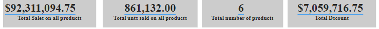

**FOR YEAR 2014 for XYZ STORES I GENERATED THE:**

1.	**Total sales on each Products**

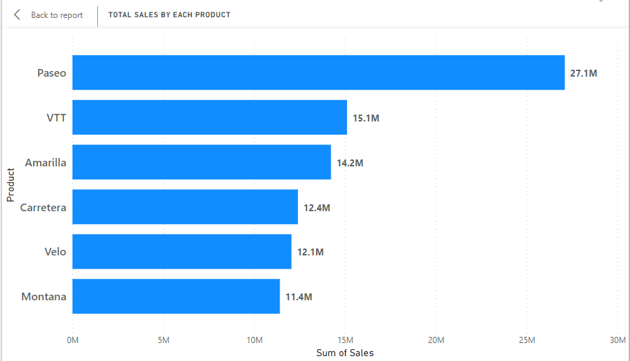

2.	**Total sales by each segments**

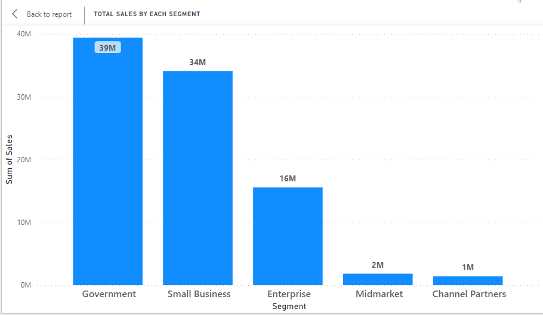

3.	**Total Units sold by each segments**

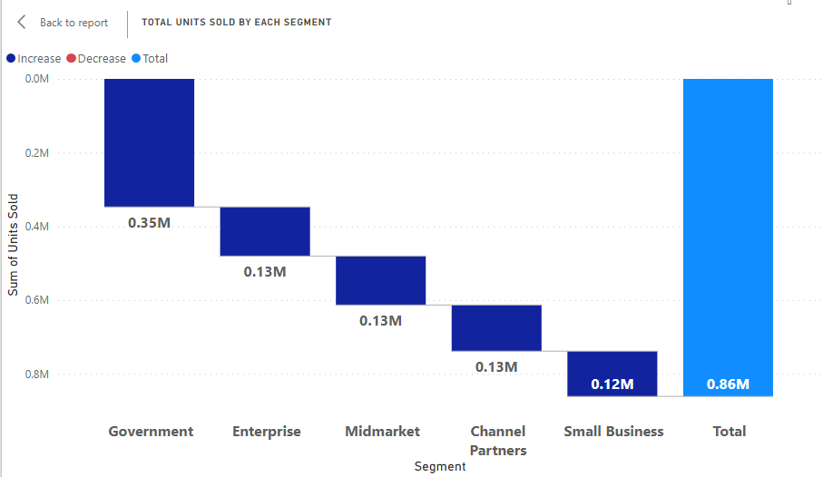

4.	**Total units sold on each products** 

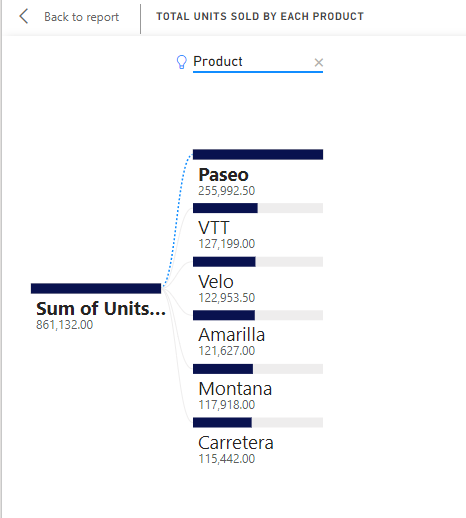

**MONTHLY**
1. **Total sales on each Products** 

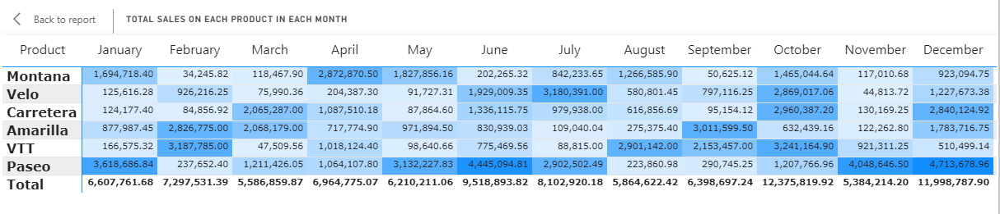

2. **Total sales by each segments**

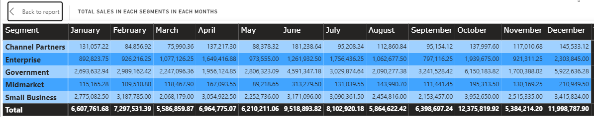

3. **Total Units sold by each segments**

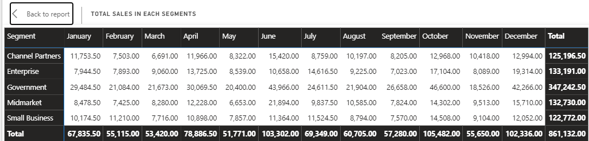

4. **Total units sold on each products**

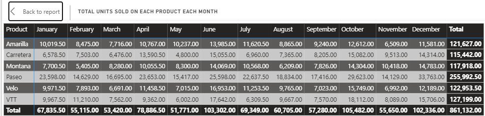

**DISCOUNTS**
1. **Total discount offered on each product for the year 2014**

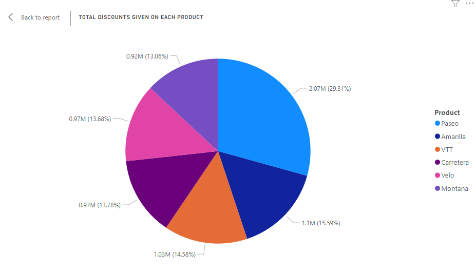

2. **Total discount offered by each segment for the year 2014**

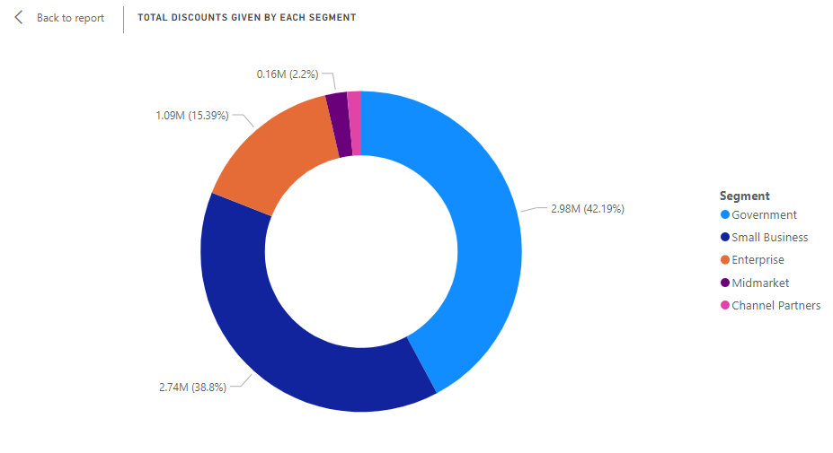

**PROFIT REMITTED**
**1. For year 2014 on each product and each segment**

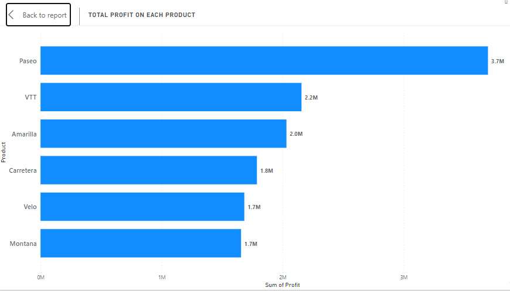

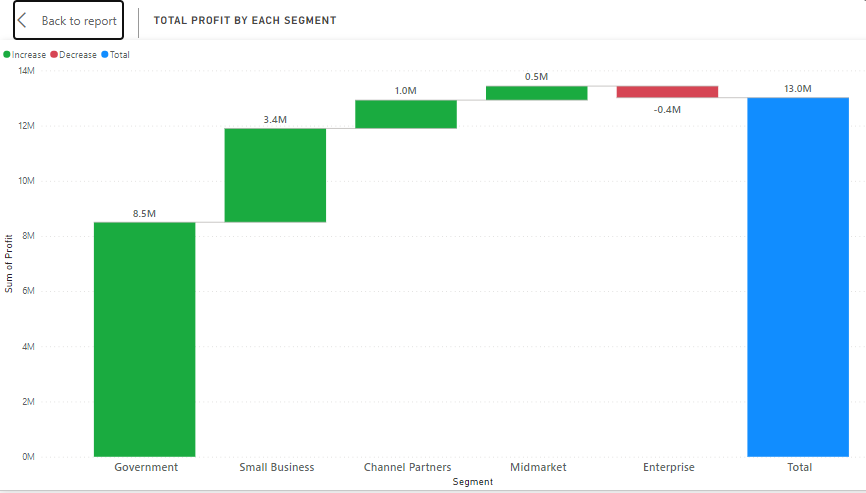
